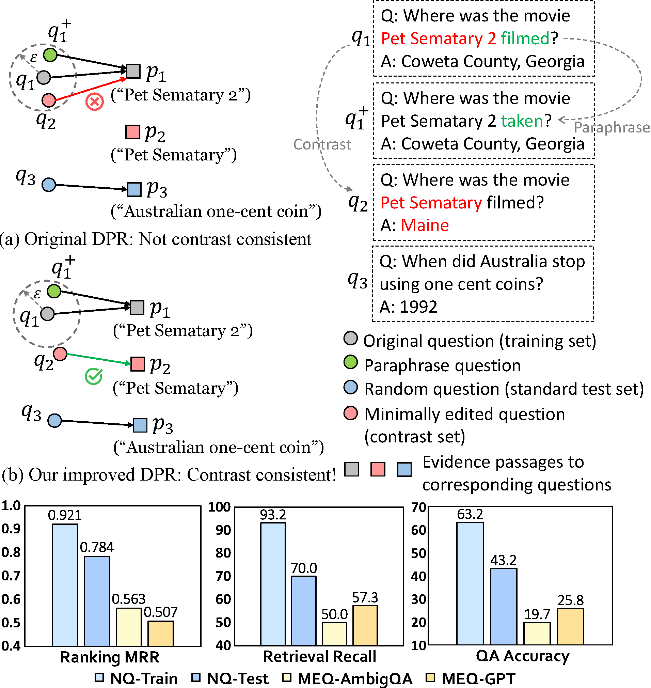
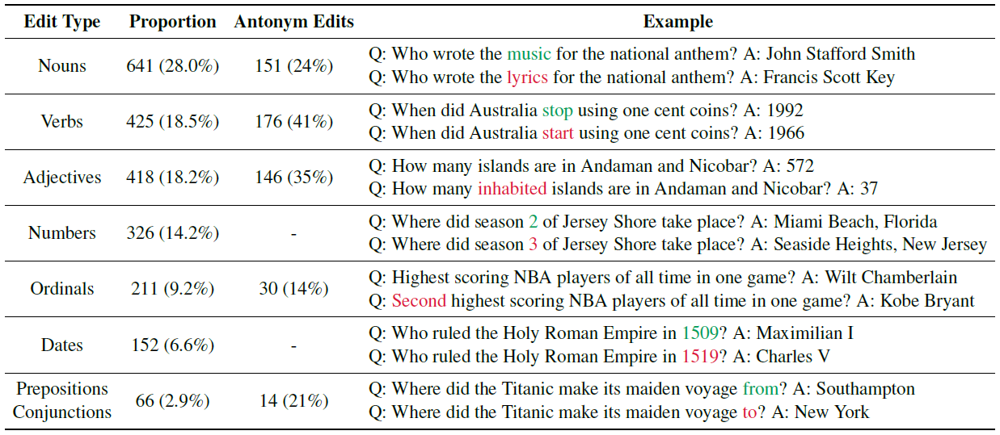
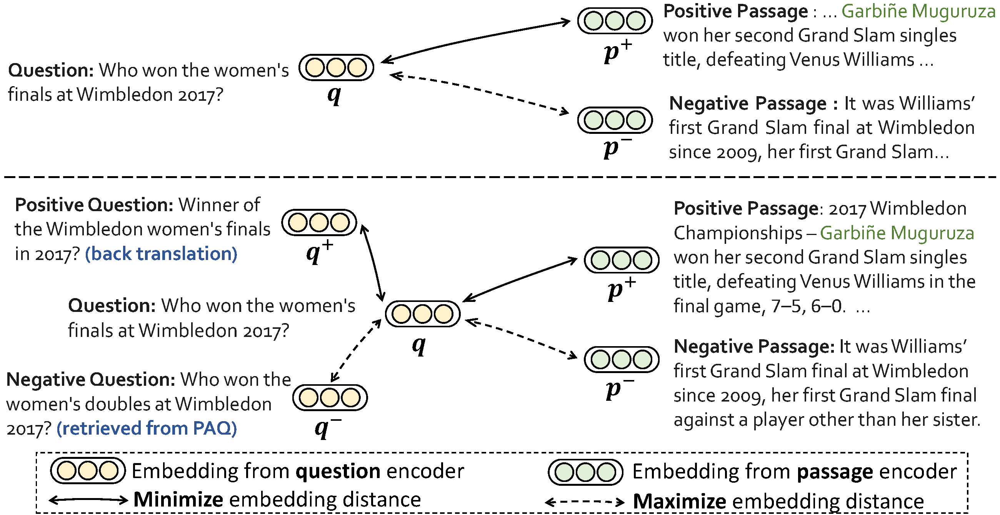

# Exploring Contrast Consistency of Open-Domain Question Answering Systems on Minimally Edited Questions

This repository contains the data and code for the paper [*Exploring Contrast Consistency of Open-Domain Question Answering Systems on Minimally Edited Questions*](https://arxiv.org/pdf/2305.14441.pdf) in TACL 2023. In this study, we explored the problem of contrast consistency in open-domain question answering by collecting **M**inimally **E**dited **Q**uestions (MEQs) as challenging contrast sets to the popular Natural Questions (NQ) benchmark, in addition to its standard test set. Through our experiments, we find that the widely used dense passage retrieval (DPR) model performs poorly on distinguishing training questions and their minimally-edited contrast set questions. Moving a step forward, we improved the contrast consistency of DPR model via data augmentation and a query-side contrastive learning objective.

<center></center>

### Data

Data can be found at [this Google Drive link](https://drive.google.com/drive/folders/1XN2duHxsYF3-8Xorok5F-nIolp_u5XPj?usp=sharing). Data includes:

- `dataset/json`: the MEQ contrast sets in text form. `Q1` is the original question from NQ training set. `Q2` is the corresponding MEQ, either retrieved from [AmbigQA](https://github.com/shmsw25/AmbigQA) or generated by InstructGPT. Their answers are `A1` and `A2`, respectively.
- `dataset/retrieval`: the same data with the json files, but in the format of DPR retrieval input. Questions are listed in pairs. The odd lines are original NQ training questions and the even lines are the corresponding MEQs.
- `dataset/ranking`: data used for ranking evaluation. We provide both the original training questions and their corresponding MEQ contrast sets to test the contrast consistency of the retrieval model (*i.e.*, compare the performance difference between the original question and the MEQ). `ambigqa-ranking.json` contains 623 examples from MEQ-AmbigQA with their gold evidence passages. `surge-ranking.json` contains 1229 examples from MEQ-GPT with their gold evidence passages. Files with name `nq-train` are the corresponding training questions from NQ.
- `dataset/train` contains the training data and the batch data indices for the model. `nq-contrastive-augment-train-dpr.jsonl` is the data used to train the model, including the original NQ data and augmented MEQs from PAQ. `contrastive-augment-33k-train-batches64_idx.jsonl` is the pre-computed data indices for each batch during the training process. This is used to carefully schedule the positive and negative questions used in the query-side contrastive loss. This data can be used for training on 1, 2 or 4 GPUs. If you are using 8 GPUs, use `contrastive-augment-33k-train-batches64_idx-8gpu.jsonl` instead (a re-arranged version of the same indices).
- `dataset/dev` dev set data used in training the model.

<center></center>

### Model

Besides the data, this repo also contains the code of training the improved DPR model mentioned in the paper, which is equipped with additional augmented data from PAQ and a query-side contrastive learning objective. The pipeline of "training the model + generating Wikipedia passage embeddings + retrieving passages from Wikipedia + evaluating the retrieval results" is in `scripts/train_dpr.sh`.

<center></center>

### Environment

The Python environment mainly follows the one used by the [original DPR repo](https://github.com/facebookresearch/DPR).

1. Install PyTorch:
```bash
pip install torch==1.8.2 torchvision==0.9.2 torchaudio==0.8.2 --extra-index-url https://download.pytorch.org/whl/lts/1.8/cu111
```

2. Install the other dependencies:
```bash
pip install -r requirements.txt
```

### Checkpoints

To be updated.

### Citation

If you use our data or code, please kindly cite our paper:
```
@article{zhang2023exploring,
  author={Zhihan Zhang and Wenhao Yu and Zheng Ning and Mingxuan Ju and Meng Jiang},
  title={Exploring Contrast Consistency of Open-Domain Question Answering Systems on Minimally Edited Questions},
  journal={Transactions of the Association for Computational Linguistics},
  volume={11},
  year={2023},
  publisher={MIT Press}
}
```
